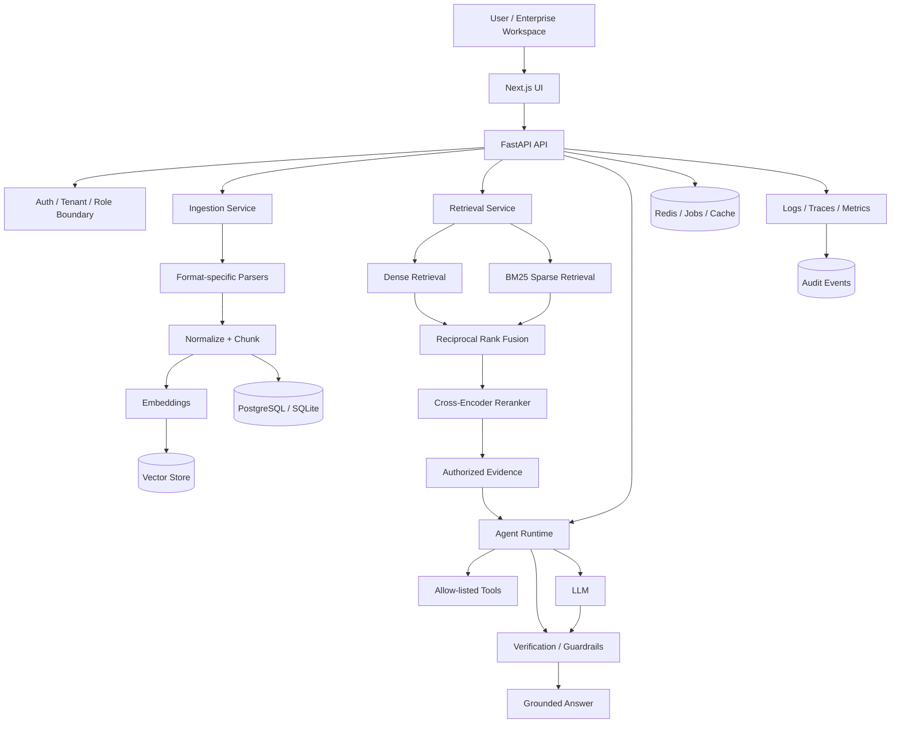
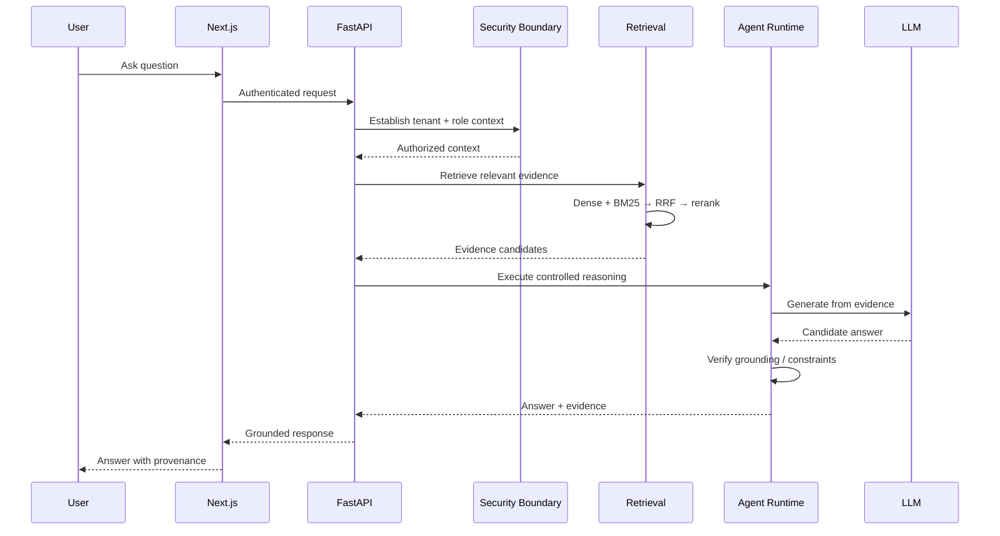
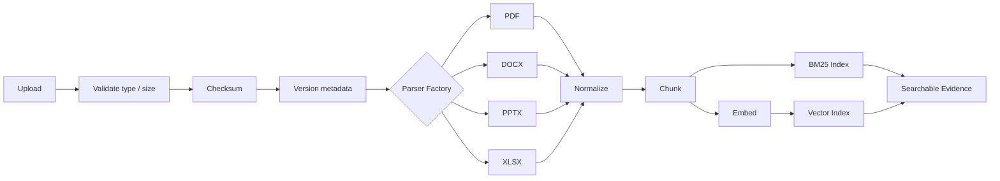
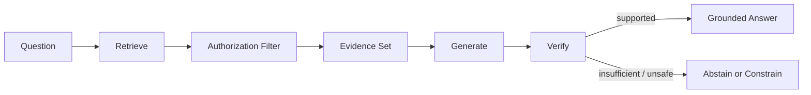
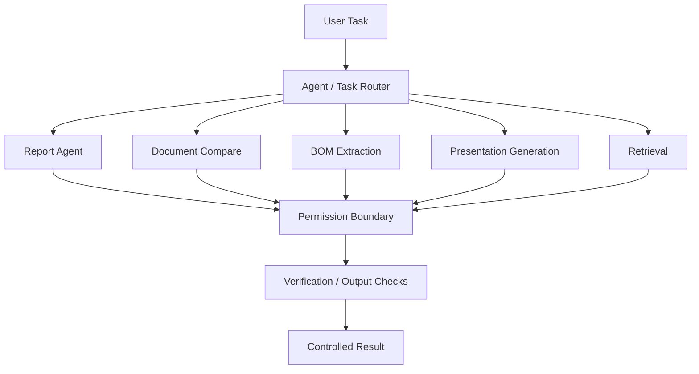
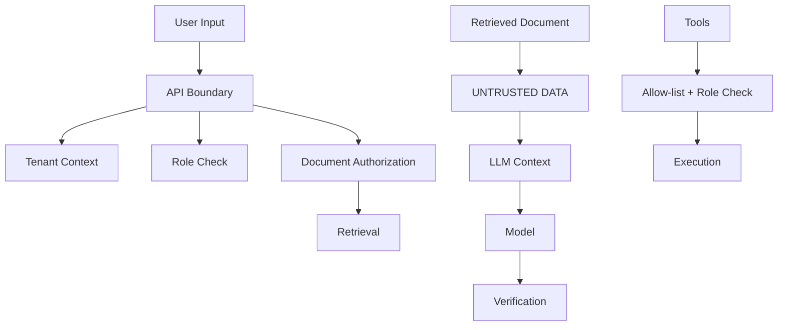
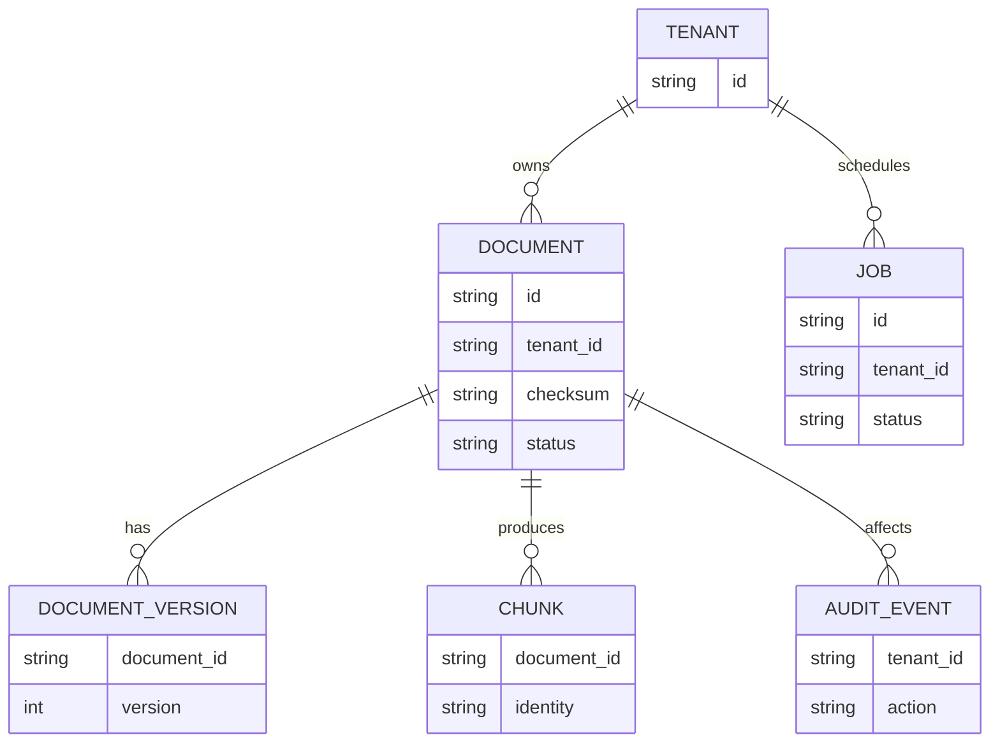
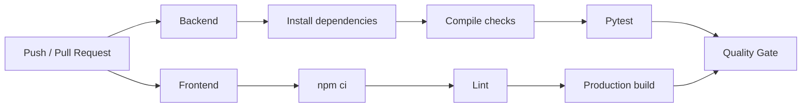

# Enterprise Document Intelligence Agent

> **Evidence-grounded AI for enterprise documents — with hybrid retrieval, reranking, controlled agent workflows, security boundaries, and measurable evaluation.**

<p align="center">
  <a href="https://github.com/affanSkhan/Enterprise-Document-Intelligence-Agent/actions/workflows/ci.yml"></a>
  
  
  
  
  
  
</p>

<p align="center">
  <a href="https://enterprise-doc-intelligence-ui.onrender.com">Live Demo</a> ·
  <a href="docs/ARCHITECTURE.md">Architecture</a> ·
  <a href="docs/SECURITY.md">Security</a> ·
  <a href="docs/EVALUATION.md">Evaluation</a> ·
  <a href="docs/ROADMAP.md">Roadmap</a>
</p>

---

## Why this project?

Most document-chat demos stop at **"upload a PDF → ask a question → call an LLM."**

This project explores what is required to move that idea toward an **enterprise-grade intelligence runtime** where the system must answer a harder question:

> **Can an AI system produce useful answers while staying grounded in authorized evidence, respecting tenant/security boundaries, and remaining measurable and maintainable?**

The platform therefore treats retrieval, authorization, agent tools, verification, evaluation, observability, and asynchronous processing as first-class engineering concerns rather than UI features.

### Core principles

| Principle | What it means |
|---|---|
| **Evidence first** | Answers are generated from retrieved evidence rather than unconstrained model knowledge. |
| **Security outside the model** | Authorization and tenant boundaries are enforced by application code. |
| **Untrusted documents** | Retrieved text is treated as data, never as trusted instructions. |
| **Controlled agents** | Agent capabilities are exposed through explicit tools and permission boundaries. |
| **Async by design** | Long-running document work is designed around jobs instead of blocking requests. |
| **Measurable AI** | Retrieval, generation, security, latency, and cost are intended to be evaluated systematically. |
| **Reproducible engineering** | Configuration, dependencies, tests, CI, architecture, and evaluation contracts live in the repository. |

---

## Product overview

The application provides an enterprise workspace for:

- 📄 **Document ingestion** — PDF, DOCX, PPTX, and XLSX
- 🔎 **Hybrid search** — dense semantic retrieval + sparse BM25 retrieval
- 🏆 **Reranking** — optional cross-encoder reranking after retrieval fusion
- 💬 **Grounded chat** — answers backed by retrieved document evidence
- 🤖 **Specialized agents** — reporting, document comparison, BOM extraction, and presentation generation
- 🔐 **Security boundaries** — tenant-aware access, role checks, document authorization primitives, and prompt-injection detection
- ⚙️ **Production data path** — PostgreSQL/SQLite metadata and Redis-oriented job/cache architecture
- 📊 **Evaluation** — retrieval and generation evaluation contracts plus regression-oriented CI foundations
- 🧭 **Observability foundations** — structured logging, audit-oriented events, tracing/cost-control architecture

> **Status note:** this is a production-oriented engineering project, not a claim that every production control is already complete. The repository intentionally distinguishes implemented foundations from remaining hardening work in `docs/ROADMAP.md`.

---

## Architecture at a glance



### Request lifecycle



---

## Document ingestion pipeline

The ingestion architecture separates **file handling**, **content extraction**, **normalization**, **chunking**, and **indexing** so each stage can evolve independently.



Supported formats currently include **PDF, DOCX, PPTX, and XLSX**. The parser factory provides a format-specific extension point, while ingestion records metadata such as checksum, tenant, version, and processing state.

---

## Retrieval: from naive RAG to hybrid search

A central engineering goal is to avoid relying on one retrieval signal.

### Retrieval stack

```text
                         ┌──────────────────┐
                         │   User Query     │
                         └────────┬─────────┘
                                  │
                    ┌─────────────┴─────────────┐
                    ▼                           ▼
             Dense Retrieval              BM25 Retrieval
             semantic similarity          lexical matching
                    │                           │
                    └─────────────┬─────────────┘
                                  ▼
                         Reciprocal Rank Fusion
                                  │
                                  ▼
                         Cross-Encoder Rerank
                                  │
                                  ▼
                         Authorized Evidence
                                  │
                                  ▼
                         Grounded Generation
```

The repository contains separate retrieval components for BM25, fusion, reranking, and the document-chat path. This makes retrieval quality independently testable and allows retrieval configuration to evolve without coupling it to the UI.

### Why hybrid retrieval?

| Retrieval method | Strength |
|---|---|
| **Dense** | Captures semantic similarity and paraphrases. |
| **BM25** | Strong for exact terminology, identifiers, names, and lexical matches. |
| **RRF** | Combines independent ranking signals without requiring them to share the same score scale. |
| **Cross-encoder** | Performs a more expensive query/document relevance pass on the fused candidates. |

---

## Evidence-grounded generation

The application is designed around an **evidence-first contract**:



This matters because a high-quality enterprise answer is not simply a fluent answer. It should also be possible to answer:

- **Where did this claim come from?**
- **Was the evidence authorized for this tenant/user?**
- **Was the evidence sufficient to answer?**
- **Can the system safely abstain when it is not?**

The architecture therefore treats evidence objects and provenance as more important than passing raw strings directly into the model.

---

## Controlled agent runtime

The project extends beyond chat by exposing specialized capabilities through explicit application routes and agent functions.



The important design choice is that **the model is not the authorization layer**. Tool access and tenant/role checks belong in deterministic application code.

---

## Security model

Security is treated as a trust-boundary problem rather than only a prompt-engineering problem.



Threat cases explicitly considered by the project include:

- prompt injection inside documents
- cross-tenant retrieval
- unauthorized tool invocation
- data exfiltration through generated output
- malicious or oversized uploads
- model/provider failures

See [`docs/SECURITY.md`](docs/SECURITY.md) for the security contract and required production controls.

---

## Data and infrastructure



### Runtime responsibilities

| Layer | Responsibility |
|---|---|
| **Next.js** | Enterprise workspace, document UI, chat, workflows, typed API integration |
| **FastAPI** | Stable API contracts, request validation, security dependencies, orchestration |
| **PostgreSQL / SQLite** | Relational metadata and local-development persistence |
| **Redis** | Job/cache architecture for production-oriented asynchronous workflows |
| **Vector store** | Dense retrieval index behind an abstraction boundary |
| **BM25** | Sparse lexical retrieval |
| **LLM** | Evidence-grounded generation and specialized intelligence tasks |
| **OpenTelemetry-compatible layer** | Tracing/observability foundation |

---

## Repository structure

```text
.
├── .github/
│   └── workflows/
│       └── ci.yml                 # Backend + frontend CI
│
├── backend/
│   ├── app/
│   │   ├── agents/                # Retrieval + specialized agents
│   │   ├── api/                   # FastAPI routes/contracts
│   │   ├── core/                  # Config, security, logging, types
│   │   ├── db/                    # SQLAlchemy models/session
│   │   ├── evaluation/            # Evaluation metrics + retrieval eval
│   │   ├── parsers/               # PDF/DOCX/PPTX/XLSX parsers
│   │   ├── retrieval/             # BM25, RRF fusion, reranking
│   │   ├── security/              # Tenant/role dependencies
│   │   └── services/              # Ingestion/search services
│   ├── requirements.txt
│   └── Dockerfile
│
├── frontend/                      # Next.js application
├── docs/
│   ├── ARCHITECTURE.md
│   ├── SECURITY.md
│   ├── EVALUATION.md
│   └── ROADMAP.md
│
└── README.md
```

---

## Local development

### 1. Clone

```bash
git clone https://github.com/affanSkhan/Enterprise-Document-Intelligence-Agent.git
cd Enterprise-Document-Intelligence-Agent
```

### 2. Backend

```bash
cd backend
python -m venv .venv
```

**Windows**

```bash
.venv\Scripts\activate
```

**Linux/macOS**

```bash
source .venv/bin/activate
```

Install dependencies:

```bash
pip install -r requirements.txt
```

Create `backend/.env` and configure the required model/database settings. For a zero-friction local setup, SQLite is supported; production deployments should use PostgreSQL and Redis.

Start the API:

```bash
uvicorn app.main:app --reload --port 8000
```

### 3. Frontend

```bash
cd ../frontend
npm install
npm run dev
```

The frontend can then be opened at the local Next.js development address shown by the terminal.

---

## API smoke tests

Once the backend is running:

```bash
curl http://localhost:8000/api/health
curl http://localhost:8000/api/ready
```

Expected health response shape:

```json
{
  "status": "ok",
  "service": "enterprise-intelligence-runtime"
}
```

The API exposes routes for document upload/listing, search, grounded chat, security scanning, and specialized agents.

---

## Evaluation and benchmarking

Evaluation is deliberately kept inside the product repository rather than relying only on subjective demo quality.

### Evaluation dimensions

```text
                 AI QUALITY
                     │
       ┌─────────────┼─────────────┐
       ▼             ▼             ▼
   Retrieval      Generation      Agent
   Recall/MRR     Grounding       Completion
   nDCG/Latency   Citations       Tool choice
       │             │             │
       └─────────────┼─────────────┘
                     ▼
                  Security
          Injection / Tenant / Tools
                     │
                     ▼
             Regression Decision
```

The evaluation contract includes:

- Recall@1 / @5 / @10
- MRR and nDCG
- P50/P95 latency
- answer relevance
- faithfulness / groundedness
- citation precision and recall
- abstention accuracy
- agent task completion and tool-selection accuracy
- prompt-injection attack success rate
- cross-tenant retrieval violations
- unauthorized tool execution

> **No invented benchmark numbers.** The repository's evaluation documentation explicitly requires results to come from reproducible runs with model/version/configuration metadata.

See [`docs/EVALUATION.md`](docs/EVALUATION.md).

---

## CI/CD

GitHub Actions validates both major application surfaces.



The current workflow runs on pushes to `main`/`phase-*` and pull requests targeting `main`, with separate backend and frontend jobs.

For the exact workflow, see [`.github/workflows/ci.yml`](.github/workflows/ci.yml).

---

## Deployment

A deployed frontend is available for demonstration:

**Live application:** https://enterprise-doc-intelligence-ui.onrender.com

Production deployment requires environment-specific configuration, including model credentials and secure PostgreSQL/Redis persistence. Secrets should never be committed to the repository.

---

## Engineering roadmap

The project is intentionally being developed in phases instead of declaring every enterprise feature complete prematurely.

### Implemented foundations

- [x] configuration and environment separation
- [x] typed relational domain model
- [x] database abstraction
- [x] structured logging foundation
- [x] upload validation and checksums
- [x] tenant-aware API boundary
- [x] security primitives
- [x] evaluation contract
- [x] architecture/security documentation
- [x] BM25 sparse retrieval
- [x] reciprocal-rank fusion
- [x] cross-encoder reranking
- [x] retrieval benchmark framework

### Next hardening layers

- [ ] resumable Celery/Redis worker execution
- [ ] complete PostgreSQL migration/deployment path
- [ ] persistent authenticated RBAC
- [ ] document ACL filtering before retrieval
- [ ] idempotency + dead-letter handling
- [ ] richer table/layout extraction
- [ ] semantic document diff and contradiction detection expansion
- [ ] calculation/tool traces and stronger citation verification
- [ ] multimodal/OCR expansion
- [ ] production OpenTelemetry/metrics dashboard
- [ ] model routing and cost controls
- [ ] load/security benchmarks
- [ ] CI evaluation regression gate
- [ ] workflow engine + human approval

For the authoritative project roadmap, see [`docs/ROADMAP.md`](docs/ROADMAP.md).

---

## Design documentation

| Document | Purpose |
|---|---|
| [`docs/ARCHITECTURE.md`](docs/ARCHITECTURE.md) | System boundaries, data flow, trust boundaries, reliability decisions |
| [`docs/SECURITY.md`](docs/SECURITY.md) | Production controls, threat cases, security-test contract |
| [`docs/EVALUATION.md`](docs/EVALUATION.md) | Benchmark schema, metrics, regression policy |
| [`docs/ROADMAP.md`](docs/ROADMAP.md) | Implemented foundations and remaining engineering phases |

---

## What makes this different from a basic RAG demo?

```text
Basic document chatbot

Upload → Chunk → Embed → Vector Search → LLM → Answer


Enterprise Intelligence Runtime

Upload
  ↓
Validate + checksum + version metadata
  ↓
Format-specific parsing + normalization
  ↓
Chunk + index
  ↓
┌───────────────────────────────────────────┐
│ Dense retrieval + BM25 + RRF + reranking │
└───────────────────────────────────────────┘
  ↓
Tenant / role / document authorization
  ↓
Evidence set
  ↓
Controlled agent + allow-listed tools
  ↓
LLM generation
  ↓
Verification / abstention boundary
  ↓
Grounded answer + provenance
  ↓
Evaluation + audit + observability
```

The goal is not simply to make an LLM answer questions about documents. The goal is to demonstrate the engineering required to make **document intelligence trustworthy, testable, observable, and extensible**.

---

## License

See the repository license and Git history for project provenance.
